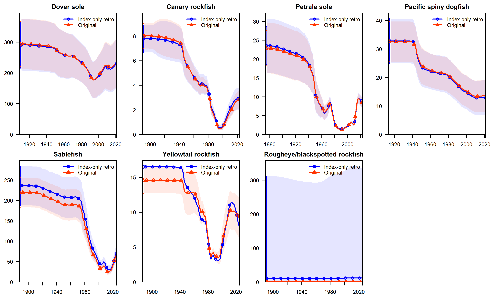
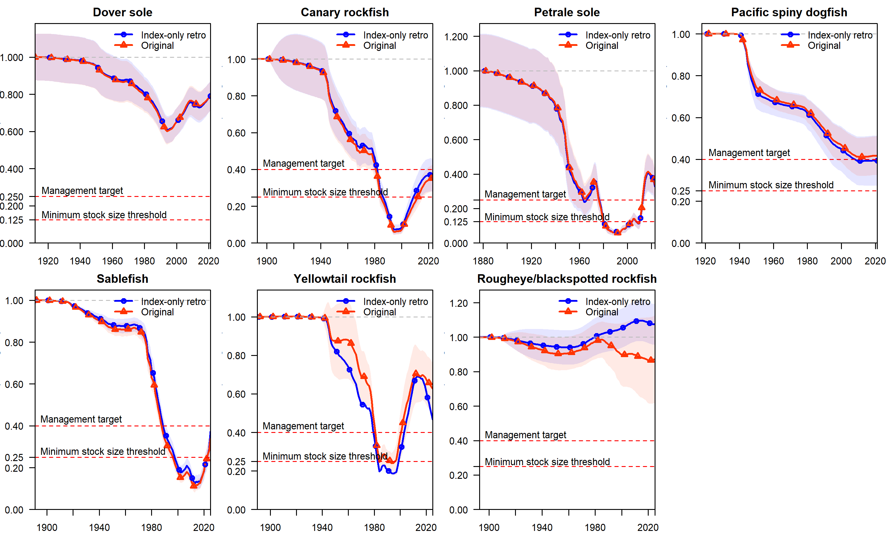
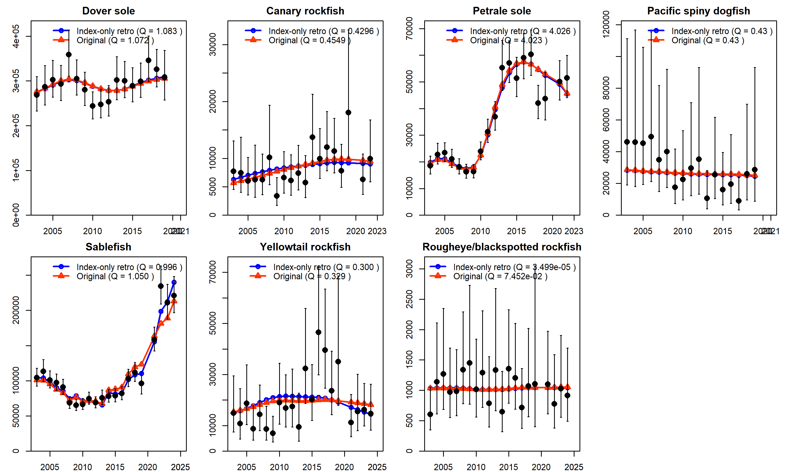

# Background
Processing data is often the most time-consuming element of the assessment workflow. The processessing of the West Coast Groundfish Bottom Trawl Survey (WCGBTS) data is the most streamlined thanks to both the consistent format of these data and the refined R package {nwfscSurvey} for processing them. This raises the question of whether a streamlined update assessment process in which only the survey data were updated would yield similar results to a full update assessment. This report explores that question by running a retrospective analysis in which the most recent 10 years of data are removed from the model except for the WCGBTS index, which is retained up to the final year of the model. The results of this analysis are compared to the results of the original model.

# Selection of assessments
The assessments were selected from a list of PFMC assessments to which the following filters were applied:

1. full assessments only, not updates
1. assessed in 2021, 2023, or 2025
1. the assessment includes an index from the WCGBTS

This resulted in the following 7 assessments being selected for the retrospective analysis (here in order of oldest to newest):

1. Dover sole (2021)                    
2. Pacific spiny dogfish (2021)         
3. Canary rockfish (2023)               
4. Petrale sole (2023)                  
5. Yellowtail rockfish (2025)           
6. Rougheye/blackspotted rockfish (2025)
7. Sablefish (2025)

# Methods

Removing data from the SS3 data file for all fleets other than the WCGBTS was really easy (the R function is only 43 lines long: [https://github.com/iantaylor-NOAA/assessment_archive/blob/main/R/index_only_retro.R](https://github.com/iantaylor-NOAA/assessment_archive/blob/main/R/index_only_retro.R)). However, three models required changes to the other input files to run successfully:

1. Dover sole: the original model use the .par file for initial values, but differences between SS3 versions required running the model from the initial values in the control file instead 
2. Sablefish: the environmental index of recruitment was excluded from the model (because it was only from the recent years that were excluded) so the associated catchability parameter also needed to be removed.
3. Canary rockfish: there were selectivity blocks that started in 2015, 2017 and 2020. Removing the fishery composition data from recent years led to really strange selectivity patterns within those blocks, so the blocks had to be aggregated.

The R script which applies the changes listed above and runs the models is available at [https://github.com/iantaylor-NOAA/assessment_archive/blob/main/R/index_only_retro_script.R](https://github.com/iantaylor-NOAA/assessment_archive/blob/main/R/index_only_retro_script.R).

# Results

The results shown in the table and figures below indicate that the 7 models could be grouped into 3 categories:

1. Models with fairly similar results between the index-only retrospective and original assessment (Dover sole, canary rockfish, petrale sole, and Pacific spiny dogfish). The dogfish assessment is stabilized by a prior on the WCGBTS catchability
2. Models which included an environmental index of recruitment the removal of which led to larger changes in the index-only retrospective(yellowtail rockfish and sablefish)
3. Models for which the scale is poorly informed in the original model, leading to large differences in the index-only retrospective (rougheye/blackspotted rockfish)

# Lessons learned

Stocks like rougheye/blackspotted rockfish with very little data to inform the scale of the model are likely not suited to this index-only update approach. Spiny dogfish would likely have had the same issue if not for the prior on the catchability of the WCGBTS index. Index based methods which make assumptions about catchability (such as applying the value from the previous full assessment) would be more robust.

Environmental indices of recruitment are an exciting area of lots of ongoing research (as demonstrated by in-prep papers from Megan, Kiva, and Nick), but they add an additional level of complexity to updating assessments. Any form of update for a model with an environmental index of recruitment will require updating the index. 

Any significant change in management (e.g. opening up midwater trawl targeting rockfish in 2017) is going to make any update approach more challenging if the change in estimates quotas are going to be appropriate for the fishery selectivity after the change.

Stocks like Dover sole with good indices from the WCGBTS and low attainment are probably well suited to a WCGBTS-only update approach.

```{r}
#| label: "tbl-results"
#| warning: FALSE
#| echo: false
#| eval: true
#| include: true

tab <- read.csv(here::here("data-raw/index_only_retro/index_only_retro_results.csv"))
tab |>
  gt::gt() |>
  gt::cols_label(
    Species = "Species",
    frac_unfished_endyr_plus1 = "Fraction unfished in final year of index-only retrospective",
    frac_unfished_endyr_plus1_original = "Fraction unfished in final year of original assessment",
    OFL_endyr_plus_3 = "OFL in final year + 3 of index-only retrospective",
    OFL_endyr_plus_3_original = "OFL in final year + 3 years of original assessment",
    frac_unfished_ratio = "Ratio of fraction unfished: retro/original",
    OFL_ratio = "Ratio of OFL: retro/original"
  ) |> 
  # format the ratio columns so that 
  # - values between 0.9 and 1.1 are colored green
  # - values between 0.5 and 0.9 or between 1.1 and 1.5 are colored yellow
  # - values less than 0.5 or greater than 1.5 are colored red
  gt::data_color(
    columns = c(frac_unfished_ratio, OFL_ratio),
    colors = scales::col_bin(
      bins = c(-Inf, 0.5, 0.9, 1.1, 1.5, Inf),
      palette = c("red", "yellow", "green", "yellow", "red")
    )
  ) |>
  # add caption
  gt::tab_caption("Comparison of fraction unfished in final year and OFL in final year + 3 between index-only retrospective and original assessment. Green values indicate ratios between 0.9 and 1.1, yellow values indicate ratios between 0.5 and 0.9 or between 1.1 and 1.5, and red values indicate ratios less than 0.5 or greater than 1.5.")
```

{#fig-id fig-alt="alt"}

{#fig-id fig-alt="alt"}

{#fig-id fig-alt="alt"}